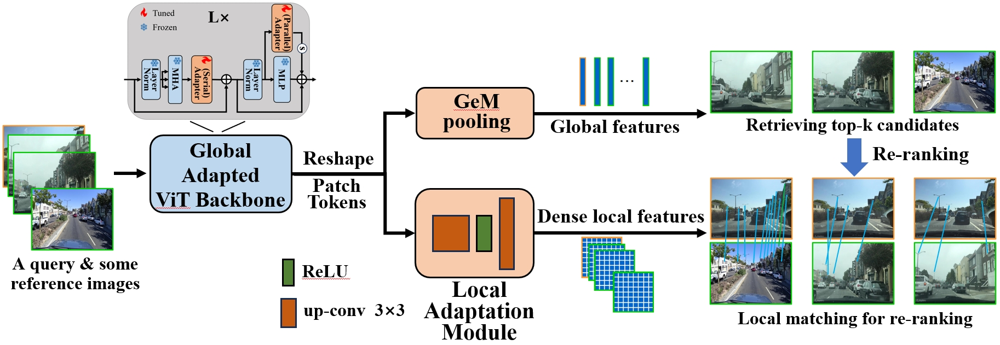

# SelaVPR
[](https://paperswithcode.com/sota/visual-place-recognition-on-pittsburgh-30k?p=towards-seamless-adaptation-of-pre-trained)
[](https://paperswithcode.com/sota/visual-place-recognition-on-pittsburgh-250k?p=towards-seamless-adaptation-of-pre-trained)
[](https://paperswithcode.com/sota/visual-place-recognition-on-tokyo247?p=towards-seamless-adaptation-of-pre-trained)
[](https://paperswithcode.com/sota/visual-place-recognition-on-mapillary-val?p=towards-seamless-adaptation-of-pre-trained)
[](https://paperswithcode.com/sota/visual-place-recognition-on-nordland?p=towards-seamless-adaptation-of-pre-trained)
[](https://paperswithcode.com/sota/visual-place-recognition-on-st-lucia?p=towards-seamless-adaptation-of-pre-trained)

This is the official repository for the ICLR 2024 paper "[Towards Seamless Adaptation of Pre-trained Models for Visual Place Recognition](https://openreview.net/pdf?id=TVg6hlfsKa)".



## Summary
This paper presents a novel method to realize **Se**am**l**ess **a**daptation of pre-trained foundation models for the (two-stage) VPR task, named **SelaVPR**. By adding a few tunable lightweight adapters to the frozen pre-trained model, we achieve an efficient hybrid global-local adaptation to get both global features for retrieving candidate places and dense local features for re-ranking. The SelaVPR feature representation can focus on discriminative landmarks, thus closing the gap between the pre-training and VPR tasks (fully unleash the capability of pre-trained models for VPR). SelaVPR can directly match the local features without spatial verification, making the re-ranking much faster.

The global adaptation is achieved by adding adapters after the multi-head attention layer and in parallel to the MLP layer in each transformer block (see adapter1 and adapter2 in /backbone/dinov2/block.py).

The local adaptation is implemented by adding up-convolutional layers after the entire ViT backbone to upsample the feature map and get dense local features (see LocalAdapt in network.py).

## Getting Started

This repo follows the [Visual Geo-localization Benchmark](https://github.com/gmberton/deep-visual-geo-localization-benchmark). You can refer to it ([VPR-datasets-downloader](https://github.com/gmberton/VPR-datasets-downloader)) to prepare datasets.

The dataset should be organized in a directory tree as such:

```
├── datasets_vg
    └── datasets
        └── pitts30k
            └── images
                ├── train
                │   ├── database
                │   └── queries
                ├── val
                │   ├── database
                │   └── queries
                └── test
                    ├── database
                    └── queries
```

Before training, you should download the pre-trained foundation model DINOv2(ViT-L/14) [HERE](https://dl.fbaipublicfiles.com/dinov2/dinov2_vitl14/dinov2_vitl14_pretrain.pth).

## Train

Finetuning on MSLS

```
python3 train.py --datasets_folder=/path/to/your/datasets_vg/datasets --dataset_name=msls --queries_per_epoch=30000 --foundation_model_path=/path/to/pre-trained/dinov2_vitl14_pretrain.pth
```

Further finetuning on Pitts30k

```
python3 train.py --datasets_folder=/path/to/your/datasets_vg/datasets --dataset_name=pitts30k --queries_per_epoch=5000 --resume=/path/to/finetuned/msls/model/SelaVPR_msls.pth
```

## Trained Models
The model finetuned on MSLS (for diverse scenes).
<table>
<thead>
  <tr>
    <th rowspan="2">DOWNLOAD<br></th>
    <th colspan="3">MSLS-val</th>
    <th colspan="3">Nordland-test</th>
    <th colspan="3">St. Lucia</th>
  </tr>
  <tr>
    <th>R@1</th>
    <th>R@5</th>
    <th>R@10</th>
    <th>R@1</th>
    <th>R@5</th>
    <th>R@10</th>
    <th>R@1</th>
    <th>R@5</th>
    <th>R@10</th>
  </tr>
</thead>
<tbody>
  <tr>
    <th rowspan="3"><a href="https://drive.google.com/file/d/1vy05l0JTEgr6n8iSoz_P_yjWfEzFPAkV/view?usp=sharing">LINK</a></td>
    <td>90.8</td>
    <td>96.4</td>
    <td>97.2</td>
    <td>85.2</td>
    <td>95.5</td>
    <td>98.5</td>
    <td>99.8</td>
    <td>100.0</td>
    <td>100.0</td>
  </tr>
</tbody>
</table>

The model further finetuned on Pitts30k (only for urban scenes).
<table>
<thead>
  <tr>
    <th rowspan="2">DOWNLOAD<br></th>
    <th colspan="3">Tokyo24/7</th>
    <th colspan="3">Pitts30k</th>
    <th colspan="3">Pitts250k</th>
  </tr>
  <tr>
    <th>R@1</th>
    <th>R@5</th>
    <th>R@10</th>
    <th>R@1</th>
    <th>R@5</th>
    <th>R@10</th>
    <th>R@1</th>
    <th>R@5</th>
    <th>R@10</th>
  </tr>
</thead>
<tbody>
  <tr>
    <th rowspan="3"><a href="https://drive.google.com/file/d/1LKTZZRHfMH3dY3UPagCt2TIlMN5LguGO/view?usp=sharing">LINK</a></td>
    <td>94.0</td>
    <td>96.8</td>
    <td>97.5</td>
    <td>92.8</td>
    <td>96.8</td>
    <td>97.7</td>
    <td>95.7</td>
    <td>98.8</td>
    <td>99.2</td>
  </tr>
</tbody>
</table>

## Test
Set rerank_num=100 to reproduce the results in paper, and set rerank_num=20 to achieve a close result with only 1/5 re-ranking runtime (0.018s for a query).
```
python3 eval.py --datasets_folder=/path/to/your/datasets_vg/datasets --dataset_name=pitts30k --resume=/path/to/finetuned/pitts30k/model/SelaVPR_pitts30k.pth --rerank_num=100
```

### Efficient RAM Usage (optional)
The test_efficient_ram_usage() function in test.py is used to address the issue of "RAM out of memory" (this issue may cause the program to be killed). You can use it simply by adding "--efficient_ram_testing" to the (train or test) run command, for example

```
python3 train.py --datasets_folder=/path/to/your/datasets_vg/datasets --dataset_name=pitts30k --queries_per_epoch=5000 --resume=/path/to/finetuned/msls/model/SelaVPR_msls.pth --efficient_ram_testing
```

```
python3 eval.py --datasets_folder=/path/to/your/datasets_vg/datasets --dataset_name=pitts30k --resume=/path/to/finetuned/pitts30k/model/SelaVPR_pitts30k.pth --rerank_num=100 --efficient_ram_testing
```

### More Details about Datasets
MSLS-val: We use the official version of [MSLS-val](https://github.com/mapillary/mapillary_sls) (only contains 740 query images) for testing, which is a subset of the MSLS-val formated by [Visual Geo-localization Benchmark](https://github.com/gmberton/deep-visual-geo-localization-benchmark) (contains about 11k query images). More detail can be found [here](https://github.com/Lu-Feng/SelaVPR/issues/1).

Nordland-test: Download the Downsampled version [here](http://webdiis.unizar.es/~jmfacil/pr-nordland/).

## Related Work

**Our another work CricaVPR (one-stage VPR based on DINOv2) presents a multi-scale convolution-enhanced adaptation method and achieves SOTA performance on several datasets. The code is released at [HERE](https://github.com/Lu-Feng/CricaVPR).**

## Acknowledgements
Parts of this repo are inspired by the following repositories:

[Visual Geo-localization Benchmark](https://github.com/gmberton/deep-visual-geo-localization-benchmark)

[DINOv2](https://github.com/facebookresearch/dinov2)

## Citation
If you find this repo useful for your research, please consider leaving a star⭐️ and citing the paper
```
@inproceedings{selavpr,
  title={Towards Seamless Adaptation of Pre-trained Models for Visual Place Recognition},
  author={Lu, Feng and Zhang, Lijun and Lan, Xiangyuan and Dong, Shuting and Wang, Yaowei and Yuan, Chun},
  booktitle={The Twelfth International Conference on Learning Representations},
  year={2024}
}
```
